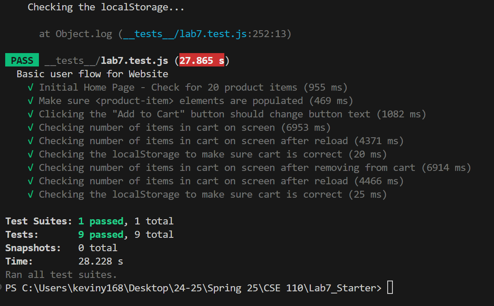

# Lab 7
---
## Check your Understanding
1) Where would you fit your automated tests in your Recipe project development pipeline? Select one of the following and explain why.

- **Within a Github action that runs whenever code is pushed**. Compared to the two other listed options, I believe that this is the best way to fit automatest tests in the pipeline. Running test locally is easy to do, but may be time-consuming and less comprehensive. Running tests after all development is completed defeats the purpose of incremental development and testing. By using GitHub Actions, we can check for linitng, create unit tests for functions, and check if the deployment in general is what we expect. 

2) Would you use an end to end test to check if a function is returning the correct output? (yes/no)

- No, end to end tests would be too much to test a single function's output. Unless the function has some output that is far-reaching in the application, unit tests would be enough to test a function. End-to-end testing should be done on multiple processes, not just one function.
  
3) What is the difference between navigation and snapshot mode?
- Navigation mode is used to assess performance of the webpage, while snapshot mode is used to checking static components of the webpage. Navigation mode is good for simulating a real user navigating the site and seeing how the loading behavior and the search engine optimization is. Snapshot mode is good for analyzing a static website (just HTML/CSS) and finding accessibility issues. 

4) Name three things we could do to improve the CSE 110 shop site based on the Lighthouse results.

    1) Properly size images - the images are too big for smaller screens and should be properly sized to not waste resources and improve loading time.
    2) The HTML is lacking a `meta name="viewport">`, which would optimize the sizing of the webapp for mobile users. Without it, there is a delay to user input.
    3) Preconnect to required origins - This webapp heavily depends on `https://fakestoreapi.com\`, which slows down performance. Lighthouse recommends to use `preconnect` or `dns-prefetch` to connect to the website earlier. However, if there is storage space, just storing the image would also be an option to consider.

- 
---
## Expose Screenshot

